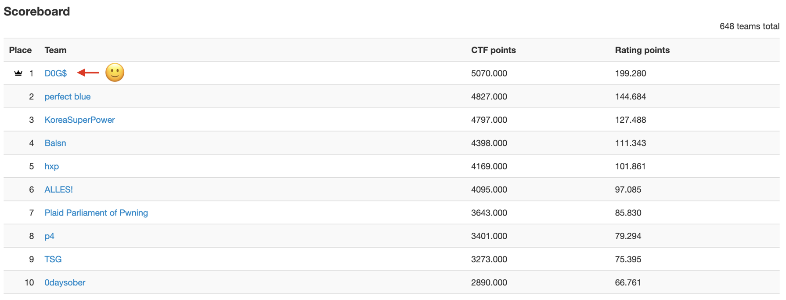

I happened to participate *TokyoWesterns CTF 6th 2020* as a web hacker.
* https://ctftime.org/event/1086
* My team - `D0G$` (Defenit + zer0pts + `GoN` + $wag)



I worked on following two web tasks:
* Supported [`Angular of universe`](https://ctftime.org/task/13080) (Thanks for `D0G$` members for co-working, `@posix`, `@s1r1us`, and `@payload`!)
* Solved [`Angular of another universe`](https://ctftime.org/task/13086)

This post is the writeup for the second task, `Angular of another universe`.

:::note[Summary of the writeup]
Bypass path filtering in `Apache -> Nginx -> Express -> Angular SSR` setting, using Angular-specific routing mechanism for `router-outlet`.
:::

## Goal
The goal is simple. Reach angular route path `"debug/answer"` to get flag.
```typescript file="/app/src/app/debug/debug-routing.module.ts"
// ...
const routes: Routes = [
  { path: 'debug/answer', component: AnswerComponent } // <- access here!
];
// ...
```
```html file="/app/src/app/debug/answer/answer.component.html"
<!-- ... -->
<p class="lead">You want this? {{flag}}</p>
<!-- ... -->
```
But there are some obstacles.

## Obstacle: Request filtering policies from different proxies
The given Angular app was wrapped with three layers:
> `(1) Apache2 -> (2) Nginx -> (3) Express (-> and then finally reaches Angular SSR)`

Each layers has following request filters:
#### Apache2
```
<Location /debug>
  Order Allow,Deny
  Deny from all
</Location>

ProxyRequests Off
ProxyPreserveHost on
ProxyPass / http://nginx:8080/
```
#### Nginx
```
location / {
  proxy_pass http://app;
  proxy_set_header Host $host;
}
location /debug {
  # IP address restriction.
  # TODO: add allowed IP addresses here
  allow 127.0.0.1;
  deny all;
}
```
#### Express
```typescript
// ...
server.get('*', (req, res) => {
  if (process.env.FLAG && req.path.includes('/debug')) {
    return res.status(500).send('debug page is disabled in production env')
  }
  // ...
}
```

How can I reach `"debug/answer"` route with bypassing these three filtering policies?

## Failure: Abusing `Apache2 -> Nginx -> Express`

The biggest obstacle was Apache2. Unlike Nginx, Apache2 handles most of useful characters (e.g. `%`, `\`) before matching with `<Location /debug>`.

Here are some useful tricks if there was't Apache2:
* Using `\` instead of `/`
* url-encoding
  * Since `proxy_pass` value in `nginx.conf` has no trailing slash, nginx forwards the initial request without enough processing (e.g. url-decoding).
* `//`
* https://github.com/GrrrDog/weird_proxies shows useful tricks about abusing different proxy behaviors.

**But here with Apache2, most of the above tricks are disabled.**
* **Many special characters are url-encoded** at the end.
  * except `!$&'()*+,-.:;=@_~`
* **All alphanumeric characters are url-decoded** at the end.
* `%2f` yields 404 by default

So these didn't work:
* `GET \debug\answer`
* `GET /a/..%2fdebug/answer`
* `GET /%64ebug/answer`

Although our team searched for useful differences between Apache2 and Nginx, nothing came up. Hence, I started to focus on Angular itself while other mates were investigating Apache2/Nginx.

## Solution: `@angular/router` to the rescue!
In order to investigate how Angular handles routing, I looked up the source code of `@angular/router`, starting from `Router.parseUrl`.
* https://github.com/angular/angular/blob/e498ea9b5a9c869394eec3026dd386d3e7014b8d/packages/router/src/router.ts#L1188-L1197
```typescript file="/packages/router/src/router.ts"
/** Parses a string into a `UrlTree` */
parseUrl(url: string): UrlTree {
  let urlTree: UrlTree;
  try {
    urlTree = this.urlSerializer.parse(url); // this.urlSerializer -> DefaultUrlSerializer is injected as DI value
  } catch (e) {
    urlTree = this.malformedUriErrorHandler(e, this.urlSerializer, url);
  }
  return urlTree;
}
```

* https://github.com/angular/angular/blob/e498ea9b5a9c869394eec3026dd386d3e7014b8d/packages/router/src/url_tree.ts#L273-L296
```typescript file="/packages/router/src/url_tree.ts"
/**
 * @description
 *
 * A default implementation of the `UrlSerializer`.
 *
 * Example URLs:
 *
 * ```
 * /inbox/33(popup:compose)
 * /inbox/33;open=true/messages/44
 * ```
 *
 * DefaultUrlSerializer uses parentheses to serialize secondary segments (e.g., popup:compose), the
 * colon syntax to specify the outlet, and the ';parameter=value' syntax (e.g., open=true) to
 * specify route specific parameters.
 *
 * @publicApi
 */
export class DefaultUrlSerializer implements UrlSerializer {
  /** Parses a url into a `UrlTree` */
  parse(url: string): UrlTree {
    const p = new UrlParser(url);
    return new UrlTree(p.parseRootSegment(), p.parseQueryParams(), p.parseFragment());
  }
  // ...
}
```
Here, I noticed that Angular treats url segments like `(a:b)` `;a=b` specially, **which are not considered by Apache2 and Nginx**. After quick googling, it turns out that Angular uses `(outlet_name:route_path)` in url to specify [`secondary outlet`](https://medium.com/angular-in-depth/angular-router-series-secondary-outlets-primer-139206595e2), and not only the secondary outlet, `primary outlet` also exists.

I checked Angular's source code to see how `(outlet_name:route_path)` in url is parsed and become a part of UrlTree. Finally, I found that **primary outlet can be easily changed by input url**, just like how secondary outlet can be specified in url.
* https://github.com/angular/angular/blob/e498ea9b5a9c869394eec3026dd386d3e7014b8d/packages/router/src/url_tree.ts#L602-L613
```typescript file="/packages/router/src/url_tree.ts"
let outletName: string = undefined!;
if (path.indexOf(':') > -1) {
  outletName = path.substr(0, path.indexOf(':')); // <- (secondary) outlet to overwrite
  this.capture(outletName);
  this.capture(':');
} else if (allowPrimary) {
  outletName = PRIMARY_OUTLET; // <- PRIMARY_OUTLET := 'primary'
}

const children = this.parseChildren();
segments[outletName] = Object.keys(children).length === 1 ? children[PRIMARY_OUTLET] :
                                                            new UrlSegmentGroup([], children);
```

Since primary outlet is always rendered (from `<router-outlet></router-outlet>`), I can get rendered page for `debug/answer` route by **overwriting `primary` outlet with `debug/answer` route.**

Therefore, this simple payload gave me the flag.
```
GET /(primary:debug/answer)
```